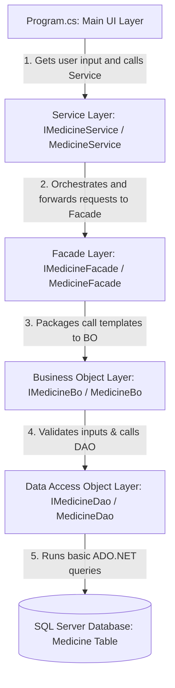

# Layered Architecture Explanation — Pharmacy Medicine Management System (Add & View Edition)

This document provides a simple, beginner-friendly explanation of the Pharmacy Medicine Management System's **Layered Architecture**. This structure implements only two CRUD APIs: **Add Medicine** and **View Medicine**, using the pre-existing `Medicine` table in SQL Server.

---

## 1. Architectural Diagram

Each layer in the program has a single responsibility. They call each other in a chain starting from the user's keystrokes in the console screen down to the SQL Server database:

---

## 2. Layer Definitions & Namespaces

1. **Value Object (VO)** (`PharmacyManagementVo`):
   * Class `MedicineVo.cs`: A class containing public properties (`Medicine_Id_PK`, `Medicine_Name`, `Medicine_Dosage`, `Medicine_Price`) that match the exact columns of the database table. It has no methods or constructors.

2. **Data Access Object (DAO)** (`PharmacyManagementDao`):
   * Class `MedicineDao.cs`: Contains the interface `IMedicineDao` and the concrete class `MedicineDao`. Executes SQL commands (`INSERT`, `SELECT`) using direct ADO.NET methods. Connections are opened manually via `conn.Open()` and closed via `conn.Close()`.

3. **Business Object (BO)** (`PharmacyManagementBo`):
   * Class `MedicineBo.cs`: Contains the interface `IMedicineBo` and the concrete class `MedicineBo`. Checks the business rules before passing data to the database. Validates that the name and dosage are not empty, and the price is not negative. If validations fail, it throws a custom `MedicineException`.

4. **Facade Layer** (`PharmacyManagementFacade`):
   * Class `MedicineFacade.cs`: Contains the interface `IMedicineFacade` and the concrete class `MedicineFacade`. Acts as a simplified interface wrapper that passes requests directly to the BO layer.

5. **Service Layer** (`PharmacyManagementService`):
   * Class `MedicineService.cs`: Contains the interface `IMedicineService` and the concrete class `MedicineService`. Acts as a bridge between the UI layer and the Facade layer.

6. **Main Program** (`PharmacyManagementMain`):
   * Class `Program.cs` & `appsettings.json`: Handles the UI menu loop directly inside the `Main` method. It displays the menu options (1. Add Medicine, 2. View Medicine, 3. Exit), reads inputs, shows results, catches exceptions, and logs messages via Serilog.

7. **Exception Layer** (`PharmacyException`):
   * Class `PharmacyException.cs` (implements custom `MedicineException`): Used specifically for validation errors.

---

## 3. Student Viva Questions & Answers

1. **Q: Why does the VO class map exactly to the database columns?**
   * *A:* It represents the structure of the database record so that data can be loaded directly from the database reader into memory properties (`Medicine_Id_PK`, `Medicine_Name`, `Medicine_Dosage`, `Medicine_Price`).

2. **Q: What is the purpose of the Facade layer?**
   * *A:* A Facade provides a simplified interface to a larger body of code (like the Business Logic or Data Access layers). It prevents the Service layer from having to manage or connect to multiple complex subsystem rules directly.

3. **Q: How does logging work in this project?**
   * *A:* We use **Serilog** configured inside `Program.cs`. It writes diagnostic execution logs to the console window and writes detailed trace files to a text file inside `Logs/pharmacy_log.txt`.

4. **Q: What is SQL injection, and how do we prevent it?**
   * *A:* SQL injection is when a user inserts malicious SQL commands into text boxes. We prevent it by using **parameterized queries** (like `@Name`) in ADO.NET instead of direct string concatenation.

5. **Q: What happens if a validation fails?**
   * *A:* The BO layer throws a custom `MedicineException` with a message. The menu loop inside `Program.cs` catches the exception using `try-catch` blocks and prints the message back to the console screen.
